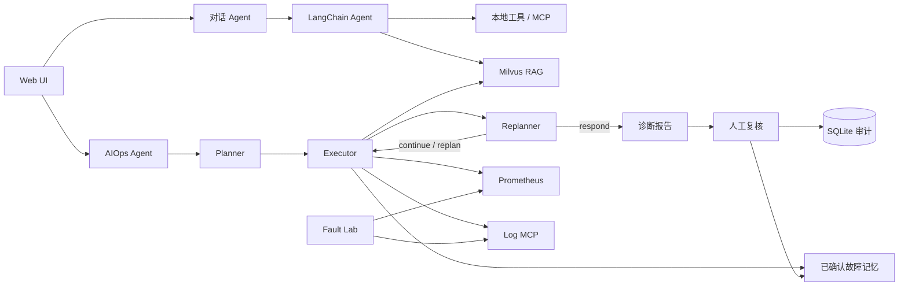

# OnCall Agent

一个面向故障排查演示、学习和评测的 AIOps 项目。项目包含两个 Agent：面向日常问答的工具调用式 RAG 对话 Agent，以及基于 LangGraph `Plan → Execute → Replan` 工作流的 AIOps 诊断 Agent。

项目通过 Prometheus、结构化日志 MCP、Milvus、故障实验室和人工确认的故障记忆，形成完整诊断闭环：

```text
外部故障基准 / 本地故障回放
          ↓
Prometheus 指标 + 结构化日志
          ↓
AIOps Agent 规划、执行、重新评估
          ↓
诊断报告 + 人工复核
          ↓
SQLite 审计记录 + Milvus 故障记忆
          ↓
后续相似故障检索与辅助诊断
```

## 核心能力

### 对话 Agent

- 使用 LangChain `create_agent` 和通义千问模型。
- 通过工具调用自主决定是否检索 Milvus RAG 知识库。
- 支持普通回答、SSE 流式输出和多轮会话记忆；达到 Token/消息阈值后自动生成摘要，并以“最新摘要 + 最近 N 轮”滑动窗口控制模型上下文。
- 可调用本地工具以及 Log/Monitor MCP 工具。

### AIOps Agent

- 使用 LangGraph `StateGraph` 实现显式状态流转。
- Planner 根据任务、RAG 文档、历史故障记忆和可用工具生成计划。
- Executor 每次执行一个步骤，调用 Prometheus、日志、知识库或 MCP 工具获取证据。
- Replanner 根据已有证据选择继续、调整计划或生成报告。
- 支持实时告警诊断和人工输入故障现象两种模式。
- 报告区分当前事实、基于证据的推断和待验证假设。

### 故障实验室

- 在独立的 `9910` 端口运行，不修改 OnCall Agent 主服务。
- 支持数据库异常、依赖超时、高延迟和间歇性错误等本地场景。
- 支持从 RCAEval 故障类型派生的 CPU、内存、磁盘、网络延迟、丢包和 Socket 耗尽场景。
- 生成真实的本地 HTTP 请求、Prometheus 指标和结构化日志。
- 非正常场景默认在安全时限后自动恢复。

### 故障记忆闭环

- Agent 诊断结果不会自动成为可信经验。
- 值班人员必须人工确认现象、证据、根因、处置和恢复验证。
- SQLite 保存可审计的结构化记录，Milvus 保存语义向量。
- 历史案例只能作为排查线索，不能替代当前指标和日志证据。

### RAG 知识库

- 启动时按 SHA-256 内容哈希增量同步 `aiops-docs/*.md`。
- 未修改的文档不会重复生成 Embedding。
- 同名文档更新时替换旧向量，避免长期重复。
- 使用 Dense 向量、BM25 关键词和 Metadata 匹配三路召回，并通过 RRF 完成候选去重与排名融合。
- Dense 或关键词链路不可用时自动降级到其余召回路径；知识文档与历史故障记忆保持独立检索，避免混淆当前证据和历史线索。
- 支持手动跳过同步或强制重建。

## 系统架构



## 技术栈

- Python 3.11～3.13
- FastAPI + Uvicorn
- LangChain + LangGraph
- 通义千问 / DashScope
- Milvus + MinIO + etcd
- Prometheus
- MCP（结构化日志、监控查询）
- SQLite
- 原生 HTML、CSS、JavaScript
- Docker Compose + uv

## 快速开始（Windows）

### 环境要求

- Windows 10/11
- Python 3.11～3.13
- [uv](https://docs.astral.sh/uv/)
- Docker Desktop
- DashScope API Key

### 1. 配置环境变量

在项目根目录创建 `.env`：

```env
DASHSCOPE_API_KEY=your-real-api-key
DASHSCOPE_MODEL=qwen-max
DASHSCOPE_EMBEDDING_MODEL=text-embedding-v4
MILVUS_HOST=localhost
MILVUS_PORT=19530
PROMETHEUS_BASE_URL=http://127.0.0.1:9090
FAULT_LAB_BASE_URL=http://127.0.0.1:9910
RAG_TOP_K=3
RAG_CANDIDATE_K=8
RAG_RRF_K=60
RAG_KEYWORD_CORPUS_LIMIT=2000
CONVERSATION_SUMMARY_TRIGGER_TOKENS=6000
CONVERSATION_SUMMARY_TRIGGER_MESSAGES=12
CONVERSATION_SUMMARY_KEEP_MESSAGES=10
CONVERSATION_WINDOW_TURNS=6
INCIDENT_MEMORY_TOP_K=3
```

### 2. 启动

先启动 Docker Desktop，然后运行：

```powershell
.\start-windows.bat
```

脚本会检查运行环境，启动 Milvus、Prometheus、Fault Lab、两个 MCP 服务和 FastAPI，等待健康检查，并增量同步发生变化的 AIOps 文档。

### 3. 访问

| 服务 | 地址 |
|---|---|
| Web UI | http://localhost:9900 |
| OpenAPI | http://localhost:9900/docs |
| 健康检查 | http://localhost:9900/health |
| Prometheus | http://localhost:9090 |
| Fault Lab | http://localhost:9910/health |

### 4. 停止

```powershell
.\stop-windows.bat
```

## 推荐演示流程

1. 打开 Web UI 并进入 AI Ops。
2. 在故障实验室选择本地场景或 `[外部基准]` 场景。
3. 启用场景并产生实验流量。
4. 等待 Prometheus 完成采集和告警评估。
5. 执行实时 AIOps 诊断。
6. 检查报告是否引用当前指标和日志证据。
7. 人工验证根因和处置结果。
8. 只有确认无误后，才写入故障记忆。
9. 再次回放相似场景，观察历史经验是否作为线索被检索。

## RAG 同步控制

正常启动只同步新增或发生变化的文档。

完全跳过同步：

```powershell
$env:RAG_SYNC_MODE = "skip"
.\start-windows.bat
Remove-Item Env:RAG_SYNC_MODE
```

Milvus 数据被清空后强制重建：

```powershell
$env:RAG_SYNC_MODE = "force"
.\start-windows.bat
Remove-Item Env:RAG_SYNC_MODE
```

同步清单保存在 `volumes/aiops-docs-manifest.json`。

## 主要 API

| 方法 | 路径 | 说明 |
|---|---|---|
| GET | `/health` | 主服务及依赖健康状态 |
| GET | `/metrics` | 主服务 Prometheus 指标 |
| POST | `/api/chat` | 非流式对话 |
| POST | `/api/chat_stream` | SSE 流式对话 |
| POST | `/api/chat/clear` | 清空会话记忆 |
| GET | `/api/aiops/sources` | AIOps 数据源状态 |
| POST | `/api/aiops` | SSE AIOps 诊断 |
| POST | `/api/upload` | 上传并索引知识文档 |
| GET | `/api/fault-lab` | Fault Lab 场景与状态 |
| POST | `/api/fault-lab/run` | 产生实验流量 |
| POST | `/api/incidents` | 人工确认并保存故障记忆 |
| GET | `/api/incidents` | 查询故障记忆 |
| GET | `/api/incidents/search` | 语义检索故障记忆 |
| DELETE | `/api/incidents/{incident_id}` | 删除错误经验 |

### 对话示例

```bash
curl -X POST http://localhost:9900/api/chat \
  -H "Content-Type: application/json" \
  -d '{"Id":"demo-session","Question":"如何排查接口延迟升高？"}'
```

### 实时 AIOps 诊断

```bash
curl -N -X POST http://localhost:9900/api/aiops \
  -H "Content-Type: application/json" \
  -d '{"session_id":"demo-aiops","mode":"realtime"}'
```

### 人工描述诊断

```bash
curl -N -X POST http://localhost:9900/api/aiops \
  -H "Content-Type: application/json" \
  -d '{
    "session_id":"demo-manual",
    "mode":"manual",
    "service_name":"checkoutservice",
    "description":"接口延迟升高并伴随少量 500 错误"
  }'
```

## 数据来源与证据边界

| 类型 | 用途 | 是否可直接作为当前故障证据 |
|---|---|---|
| 当前 Prometheus 指标 | 实时诊断 | 是 |
| 当前结构化日志 | 实时诊断 | 是 |
| `aiops-docs` Runbook | 通用排查知识 | 否，仅作参考 |
| 外部故障基准 | 冷启动与评测 | 否，仅作线索 |
| 已确认故障记忆 | 相似案例检索 | 否，必须用当前证据验证 |

当前外部案例主要参考 [RCAEval](https://github.com/phamquiluan/RCAEval)。

## 项目结构

```text
app/
├── agent/aiops/              # Planner、Executor、Replanner、状态定义
├── api/                      # Chat、AIOps、Fault Lab、故障记忆接口
├── services/                 # Agent、向量索引、故障记忆与数据源服务
├── tools/                    # RAG、Prometheus、故障记忆等工具
└── main.py                   # FastAPI 入口
fault_lab/
├── datasets/                 # 外部案例目录与来源说明
├── scenarios/                # 本地场景目录
├── runbooks/                 # 场景 Runbook
└── app.py                    # 独立故障实验服务
aiops-docs/                   # RAG 运维知识文档
deploy/prometheus/            # Prometheus 配置与告警规则
mcp_servers/                  # Log MCP、Monitor MCP
static/                       # Web UI
tests/                        # 自动化测试
```

## 开发与验证

```powershell
# 同步依赖
uv --cache-dir .uv-cache sync

# 运行测试
.\.venv\Scripts\python.exe -m pytest

# 静态检查
.\.venv\Scripts\python.exe -m ruff check app fault_lab tests

# 校验 Prometheus 规则
docker exec oncall-prometheus promtool check rules /etc/prometheus/rules.yml
```

## 常见问题

### 启动卡在 RAG 同步

新版同步使用内容哈希，未变化文档会直接跳过。单个更新失败会在下次启动重试；需要临时跳过时设置 `RAG_SYNC_MODE=skip`。

### AIOps 显示 Prometheus 不可用

```powershell
docker compose -f prometheus-compose.yml ps
curl http://127.0.0.1:9090/-/ready
```

### Milvus 无法连接

```powershell
docker compose -f vector-database.yml ps
```

确认 `milvus-standalone`、`milvus-minio` 和 `milvus-etcd` 正常运行。

### Fault Lab 场景无法启用

本机访问默认不需要令牌；非本机访问必须配置 `FAULT_LAB_CONTROL_TOKEN`，并在请求中提供对应令牌。

## 安全说明

- 不要提交 `.env`、API Key、访问令牌或真实生产日志。
- Fault Lab 默认仅允许本机控制，非正常场景会自动恢复。
- 外部案例和历史经验不能替代当前监控证据。
- 在生产环境执行修复操作前必须经过人工确认、风险评估和回滚准备。

## 参考项目

- [LangChain](https://github.com/langchain-ai/langchain)
- [LangGraph](https://github.com/langchain-ai/langgraph)
- [Milvus](https://github.com/milvus-io/milvus)
- [Prometheus](https://github.com/prometheus/prometheus)
- [RCAEval](https://github.com/phamquiluan/RCAEval)
- [Microsoft AIOpsLab](https://github.com/microsoft/AIOpsLab)

## 许可证

本项目采用 [MIT License](LICENSE)。
